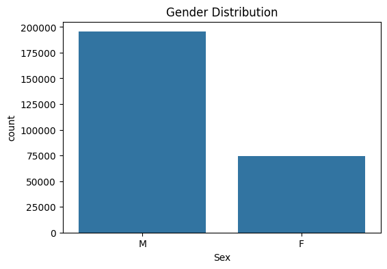
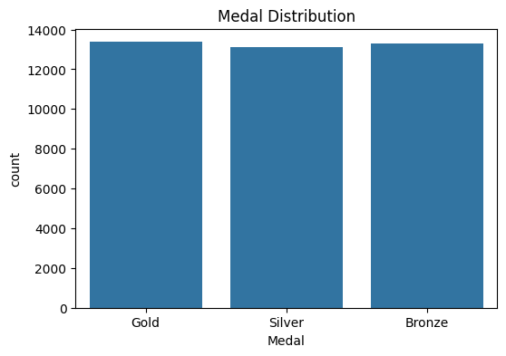
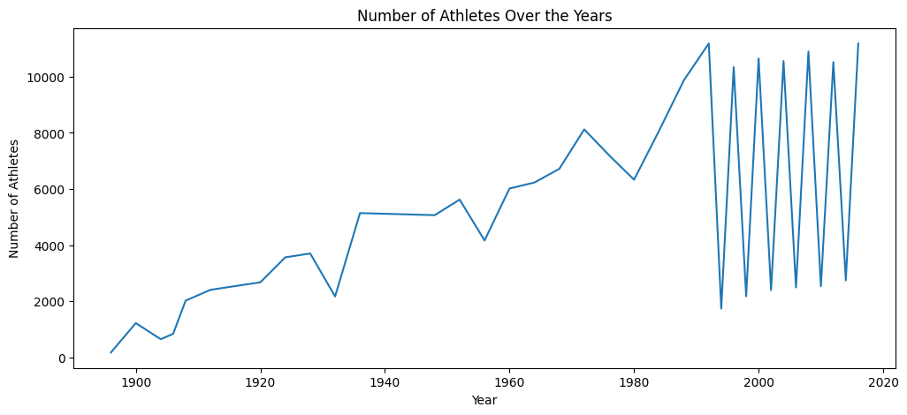
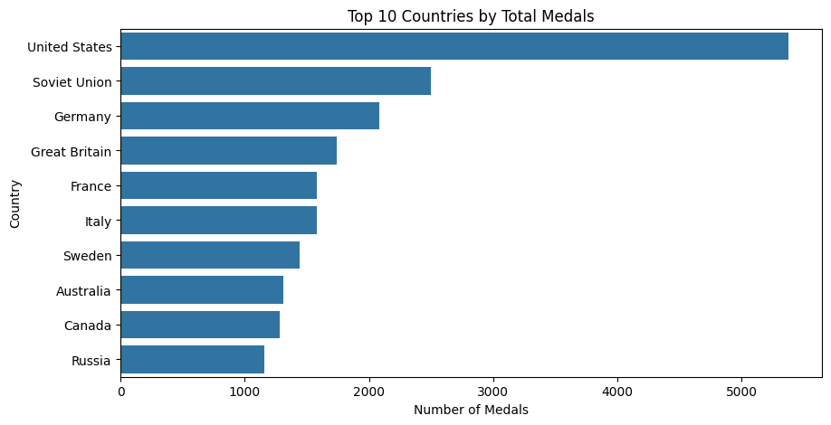

#🏅 Olympic Games Data Analysis (Python EDA Project)

##📌 Project Overview

This project analyzes historical Olympic Games data to uncover insights about athlete demographics, country performance, sports participation, and medal distribution over time.

Using Python, I performed full exploratory data analysis (EDA), data cleaning, visualization, and trend analysis on over 100 years of Olympic athlete data.

## 🎯 Business / Analytical Objectives

Analyze athlete demographics (Age, Height, Weight)

Study medal distribution across countries and sports

Identify top-performing nations

Explore Olympic participation growth over time

Compare medal trends among leading countries

## 📂 Dataset Description

The dataset contains historical Olympic athlete data with the following columns:

Column	Description
ID	Unique athlete identifier
Name	Athlete name
Sex	Gender (M/F)
Age	Athlete age
Height	Height (cm)
Weight	Weight (kg)
Team	Country / Team name
NOC	National Olympic Committee code
Games	Olympic Games identifier (e.g., 2008 Summer)
Year	Year of the Olympics
Season	Summer / Winter
City	Host city
Sport	Sport category
Event	Specific event
Medal	Gold / Silver / Bronze / None

## 🧹 Data Cleaning & Preprocessing

Removed duplicate rows

Handled missing values:

Age → Filled using median

Height → Filled using median

Weight → Filled using mean

Medal → Replaced null values with "None"

Cleaned Team names for consistency

Created filtered dataset for medal winners

## 📊 Exploratory Data Analysis Performed
📌 1. Gender Distribution

Count of male vs female athletes

📌 2. Medal Distribution

Gold, Silver, Bronze comparison

📌 3. Age Distribution

Overall distribution

Age distribution by gender

Age distribution by medal type

📌 4. Height & Weight Analysis

Distribution plots

Correlation heatmap

Height vs Weight scatter by gender

📌 5. Top 10 Countries by Medals

Based on total medal counts

📌 6. Top 10 Sports by Participation

Highest number of athletes

📌 7. Top 10 Sports by Medals

Sports generating most medals

📌 8. Participation Over Time

Number of unique athletes per year

📌 9. Medal Trends Over Time

Medal counts for top 5 countries across years

📌 10. Top 10 Athletes by Medal Count

##🔍 Key Insights

Olympic participation has grown significantly over the decades.

A small number of countries dominate global medal counts.

Athletics and Swimming consistently produce the highest medals.

Male participation historically dominated, but female participation has steadily increased.

Medal winners show specific age distribution patterns.

Height and weight characteristics vary clearly by gender.

##🛠 Technologies Used

Python

Pandas

NumPy

Matplotlib

Seaborn

Plotly

Jupyter Notebook

##📈 Example Visualizations

👤 Author

Gulam Kazim
Master’s in Computational Science
Data Engineer | Data Analyst

LinkedIn: https://www.linkedin.com/in/gmmk-5bba5125b
